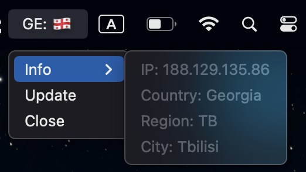
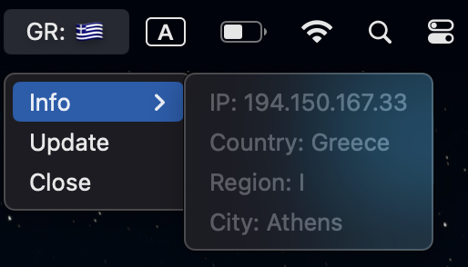
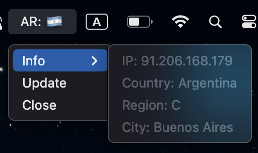

# CountryMenuBar
Приложение отображается в верхнем меню и демонстрирует, к какой стране подключено Ваше устройство по IP-адресу

***По умолчанию*** проверка происходит каждые `2 минуты`, но можно запросить обновление вручную

## Примеры работы
- Грузия

- Греция

- Аргентина

